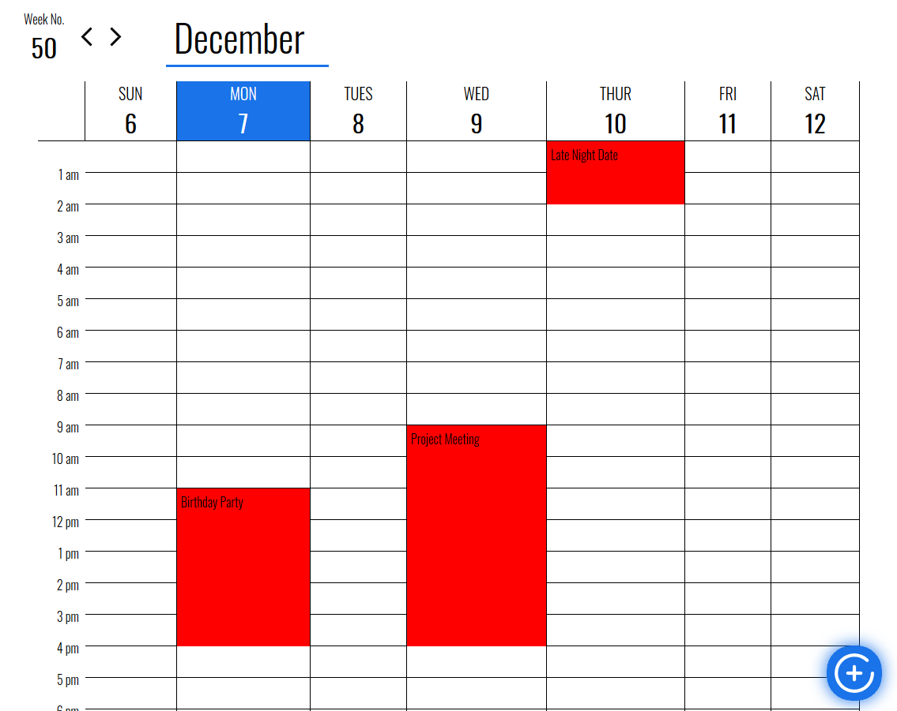
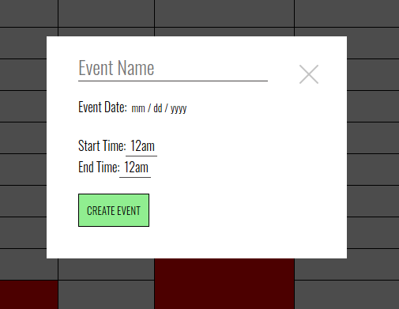
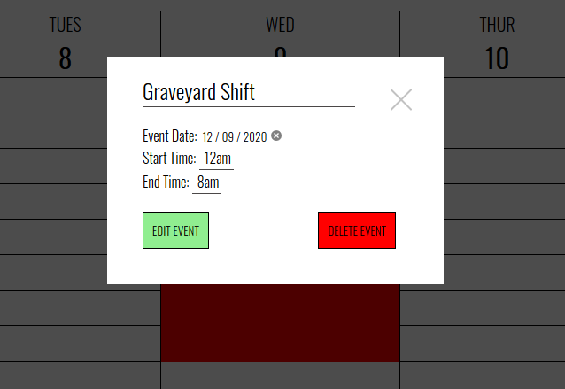

# Calendar Application using pure HTML, CSS, and JavaScript

## Preview

## Tools/Tech Used
- Pure and simple HTML, CSS, and JavaScript
- VSCode as the primary text editor.

## Functionality
- Users can create events to keep track of their busy schedules!
- Allows users to edit/move events if plans change!
- Users can also remove events if plans fall through!
- Event information is stored using localstorage, so no need to be connect to the internet!

## Possible updates
- Edit the color of the event
- Add a description for their events
- Change the view mode to monthly, daily, yearly views
- Add a backend API with Express.js